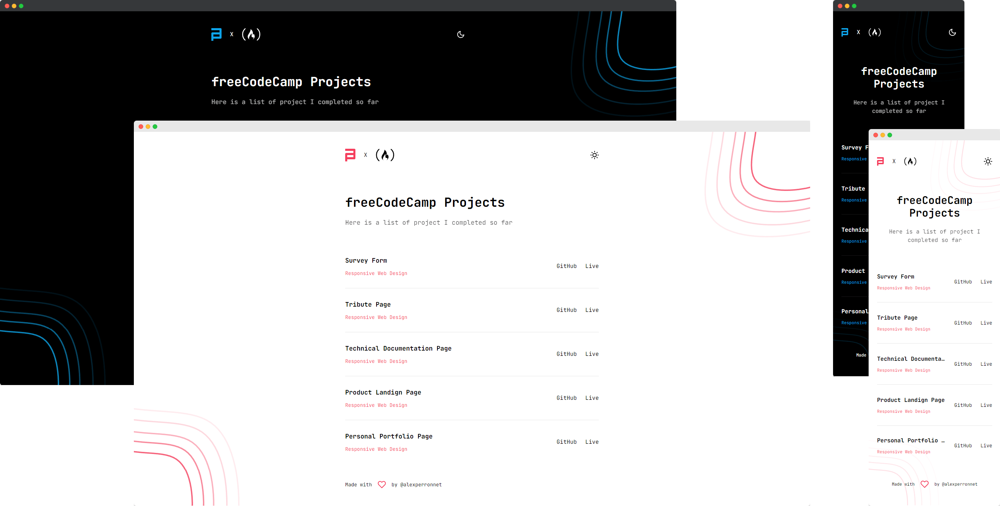

# devChallenges Showcase

This repo contains an showcase of all my projects I completed so far for [devChallenges](https://devchallenges.io/). **Each project has his own repo**.

Check out the table below to navigate through each project.

## Projects

### Responsive Web Design

| Name          | Repo                                                                                |
| ------------- | ----------------------------------------------------------------------------------- |
| 404 Not Found | [Link to GitHub repo](https://github.com/alexperronnet/devchallenges-404-not-found) |

### The Website

This showcase was build with [Vite](https://vitejs.dev/), [React](https://reactjs.org/) and [Tailwind](https://tailwindcss.com/).

#### Screenshot



#### Installation & Setup

1. Install dependencies

```sh
npm install
```

2. Start the development server

```sh
npm run dev
```

3. Generate production build

```sh
npm run build
```

4. Preview the production

```sh
npm run preview
```
