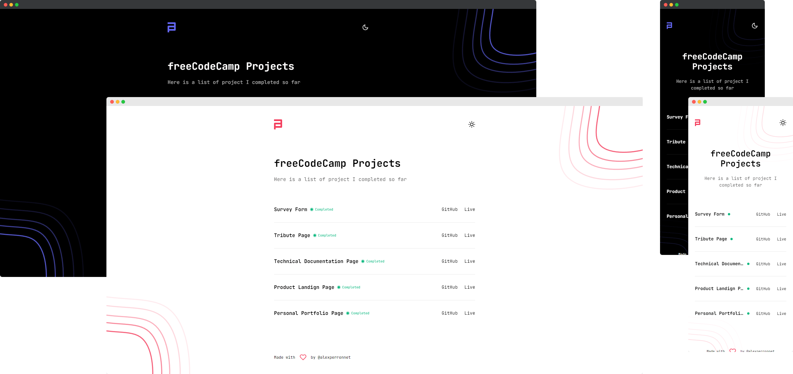

# freeCodeCamp Showcase

This repo contains an showcase of all my certification projects I completed so far for freeCodeCamp. **Each project has his own repo**.

Check out the table below to navigate through each project.

## Projects

### Responsive Web Design

| Name                         | Repo                                                                                              |
| ---------------------------- | ------------------------------------------------------------------------------------------------- |
| Survey Form                  | [Link to GitHub repo](https://github.com/alexperronnet/freecodecamp-survey-form)                  |
| Tribute Page                 | [Link to GitHub repo](https://github.com/alexperronnet/freecodecamp-tribute-page)                 |
| Technical Documentation Page | [Link to GitHub repo](https://github.com/alexperronnet/freecodecamp-technical-documentation-page) |
| Product Landing Page         | [Link to GitHub repo](https://github.com/alexperronnet/freecodecamp-product-landing-page)         |
| Personal Portfolio Webpage   | [Link to GitHub repo](https://github.com/alexperronnet/freecodecamp-personal-portfolio-webpage)   |

## Certifications

| Path                  | Status    | Certificat                                                                                        |
| --------------------- | --------- | ------------------------------------------------------------------------------------------------- |
| Responsive Web Design | Completed | [Link to certificat](https://www.freecodecamp.org/certification/aperronnet/responsive-web-design) |

### The Website

This showcase was build with [Vite](https://vitejs.dev/), [React](https://reactjs.org/) and [Tailwind](https://tailwindcss.com/).

#### Screenshot



#### Installation & Setup

1. Install dependencies

```sh
npm install
```

2. Start the development server

```sh
npm run dev
```

3. Generate production build

```sh
npm run build
```

4. Preview the production

```sh
npm run preview
```
